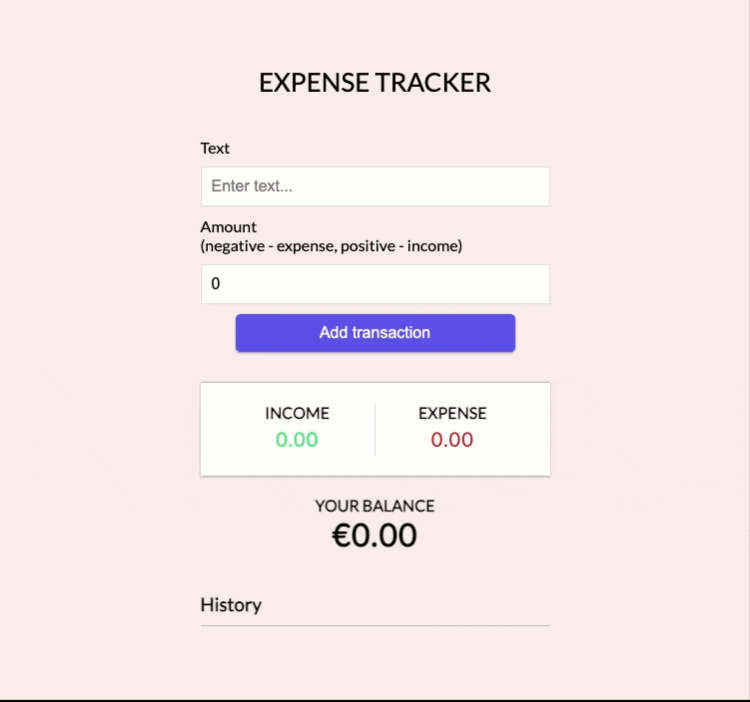

# EXPENSES TRACKER APP - REACT

> React app to track your daily expenses by entering your income and expenses.

### ✨ [Demo](https://expenses-tracker-reactapp.netlify.app/)

**Features :**

- Add amount to add income and add minus sign before amount to add the expenses aside to the label of each one.
- It will automatically calculate your balance and your income and your expenses.
- You can delete and transaction that you do not need it.

## Code Along With

[Traversy Media ](https://www.youtube.com/watch?v=XuFDcZABiDQ)

## 🤝 Contributing

Contributions, issues and feature requests are welcome! Feel free to check [issues page](https://github.com/MoSaif00/Expenses-Tracker-React/issues).
